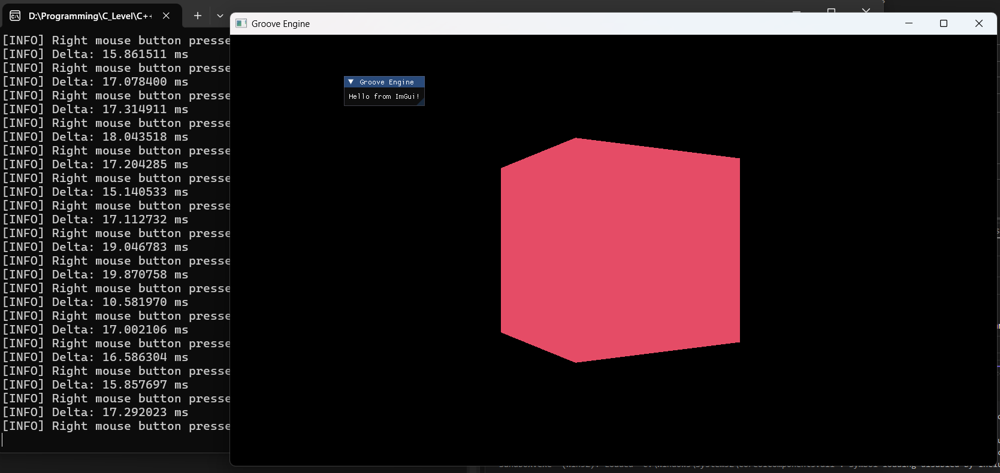
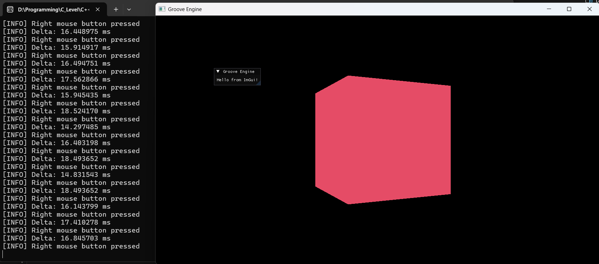

<h1 align="center">Groove Game Engine</h1>

  <b>A next-gen modular C++ game engine</b> 
  Built with OpenGL, GLFW, ImGui, and CMake. 
  <i>Realistic simulation • Extensible core • Modern code</i>

  
  
  
  
  

---

  
   
  <strong>🚦 If you see a spinning 3D cube, you're ready to groove!</strong>

---

## 🗂️ Project StructureGroove/
├─ engine/         # Core engine modules
│  ├─ Input/       # Input abstraction
│  ├─ Renderer/    # OpenGL, ImGui, shaders
│  ├─ Utils/       # Logger, helpers
│  └─ src/         # Engine, Window, Camera, TimeStep
├─ sandbox/        # Demo app (entry point)
├─ resources/      # Screenshots, shaders, textures
├─ out/            # CMake build output
├─ LICENSE.txt     # MIT License
├─ README.md       # This file
├─ Detailed_Guide.md # Deep-dive technical guide
└─ .gitignore---

## 🚀 Features

| Subsystem        | Status | Highlights                                 |
| ---------------- | :----: | ------------------------------------------ |
| 🛠️ Build System |    ✅   | CMake-based, modular targets               |
| 🪟 Windowing     |    ✅   | GLFW, resizable, VSync toggle              |
| 🎮 Input         |    ✅   | Keyboard/mouse support with edge detection |
| 📜 Logging       |    ✅   | Color console, file logs                   |
| 🖼️ Rendering    |    ✅   | OpenGL, VAO/VBO/IBO, shaders, 3D cube      |
| 🧰 UI (ImGui)    |    ✅   | Overlay, debug panels                      |
| ⏱️ Delta Time    |    ✅   | Smooth animations with TimeStep            |
| 🧠 Next Features |   🔲   | ECS, events, scene, vehicles, roads        |

---

## 📦 Requirements

* **C++17** or newer
* **Visual Studio 2022** (Desktop C++)
* **CMake 3.21+** (tested with 3.31.6)
* **vcpkg** (for dependencies)
  - `vcpkg install glfw3 glad glm imgui[glfw-binding,opengl3-binding]`
---

## ⚡ Quick Start

### 1. Clone the Repogit clone https://github.com/Adi5423/Groove-Game-Engine.git
cd Groove-Game-Engine### 2. Configure with CMakecmake -S . -B out/build/windows-debug -G "Ninja" -DCMAKE_TOOLCHAIN_FILE="<VCPKG_PATH>/scripts/buildsystems/vcpkg.cmake"### 3. Build the Enginecmake --build out/build/windows-debug --config Debug### 4. Run the Demo./out/build/windows-debug/sandbox/Sandbox.exe
---

`or if you have Visual Studio 2022 installed, follow this instead (VCPKG step is required before this):`

## 🧩 Visual Studio Workflow

* Open root folder in **Visual Studio 2022**
* Update the Toolchain location for VCPKG in [CMakePresets.json] at `"CMAKE_TOOLCHAIN_FILE"` to your VCPKG install path
* Open any `CMakeLists.txt` and Save (Ctrl+S) to auto-trigger reconfigure
* Build with `Ctrl+Shift+B` or **Build > Rebuild All**
* Run `Sandbox.exe` from the output folder

---

[📖 **Read the Detailed Technical Guide**](Detailed_Guide.md)

---

## 🎮 Controls

| Action        | Key / Input      |
| ------------- | ---------------- |
| Move Forward  | `W`              |
| Move Backward | `S`              |
| Move Left     | `A`              |
| Move Right    | `D`              |
| Move Up       | `E`              |
| Move Down     | `Q`              |
| Look Around   | `Mouse Movement` (hold RMB) |
| Toggle Cursor | Always visible   |

---

## 🎮 Input & Camera System

- **Input**: Abstracted for easy extension; supports polling and edge detection.
- **Camera**:  
  - **Movement**: Use `W`, `A`, `S`, `D` for forward/left/back/right movement.  
  - **Vertical Movement**: Use `Q` to move up, `E` to move down.
  - **Mouse Look**: Hold the **right mouse button** in the main game window to look around with the mouse.
  - **Combined Movement**: Camera movement (WASDQE) and look are only active while the right mouse button is held.
- **Cursor**: The mouse cursor is always visible and enabled; it is never locked or hidden.
- **ESC**: No longer used for toggling camera or cursor modes.
- **Mouse Delta**: Used for smooth, frame-rate-independent camera rotation, but only when the right mouse button is held.

---

## 🖥️ Engine Initialization & Main Loop

### Initialization (`Engine::Init`)
- Logger starts first to capture all events.
- Window is created (GLFW), OpenGL context is set up (GLAD).
- Input is initialized and hooked to the window.
- Renderer is set up, including OpenGL state and resources.
- Camera is created and positioned to view the scene.
- ImGui Layer is initialized after OpenGL context is ready.
- **Cursor is always visible for user interaction.**

### Main Loop (`Engine::Run`)
- Delta time is calculated each frame for smooth movement and animation.
- Input is polled: **camera movement and look are only processed when the right mouse button is held**.
- Scene is rendered: screen is cleared, cube is rotated and drawn, ImGui overlays are rendered.
- Logging: Every second, camera and cube state are logged for debugging.
- Window swaps buffers and polls events.

---

## 🖼️ Screenshots

| Output     | Preview                         |
| ---------- | ------------------------------- |
| proof1.png |  |
| proof2.png |  |

---

## 🗺️ Roadmap

* [x] Logging, Input, Window, Shaders, ImGui, 3D Cube
* [ ] ECS, Events, Scene System, Vehicles, Roads

---

## 📜 License

Licensed under the **MIT License**. See [`LICENSE.txt`](LICENSE.txt).

---

## 📬 Contact

* ✉️ [adii54ti23@gmail.com](mailto:adii54ti23@gmail.com)
* 💼 [LinkedIn](https://www.linkedin.com/in/aditya-tiwari-141731329/)
* 📸 [Instagram @adii5423\_](https://www.instagram.com/adii5423_)

<i>Made with ❤️ by Adii</i>

